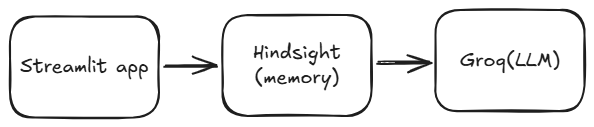
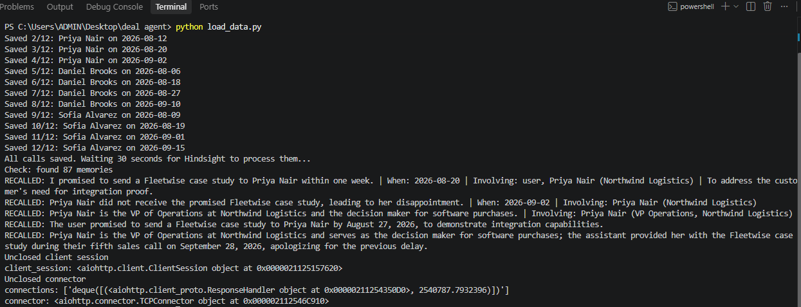

# How Hindsight Caught a Promise I Broke

Three weeks into a fictional deal cycle I built to test this, my agent told me something I didn't want to hear: I'd promised a customer a case study, and I never sent it.

I wasn't tracking that. My AI was.

## What I built

I built a sales briefing agent. You pick a prospect, it reads through every past call, and it writes you a pre-call briefing: where the deal stands, what objections are open, which competitors came up, and what you promised versus what you actually delivered. Nothing revolutionary about that idea on its own — the interesting part is what changes when the agent actually remembers, instead of just summarizing whatever text you paste in.

Most AI assistants are stateless. You give them context in the prompt, they answer, and then that context is gone. Ask the same assistant about the same customer tomorrow, and it knows nothing unless you paste everything in again. That's fine for a one-off question. It's useless for anything that unfolds over weeks — a sales deal, a support relationship, an ongoing project.

So I built this on [Hindsight](https://hindsight.vectorize.io/), a memory layer that sits between your app and your LLM. You write facts into it (`retain`), and later you ask it questions and it hands back the relevant facts (`recall`), extracted and indexed, not just stored as a blob of text.



## The core technical story

Here's the part I actually wanted to test: does memory change the output in a way that matters, or is it just a nicer database?

I logged four calls for a fictional prospect — pricing objections, a competitor mention, a promised case study — and then asked the agent for a briefing two different ways.

**Without memory**, the prompt is just:

```python
prompt = f"""You are a sales assistant. I have a call with {prospect} soon.
Write a short pre-call briefing with these sections:
1. Where the deal stands
2. Open objections and concerns
3. Competitors mentioned
4. Promises I made
5. Suggested talking points for this call"""
```

The output was fine, in the way generic advice is always fine. "Build rapport." "Understand their pain points." True of literally any deal, useful for none of them.

**With memory**, I recall first, then hand the results to the model:

```python
def recall_memories(prospect):
    query = f"Everything about {prospect}: objections, competitors, promises made, stakeholders, and next steps"
    results = memory_client.recall(bank_id=BANK, query=query)
    seen = []
    for r in results.results:
        if r.text not in seen:
            seen.append(r.text)
    return seen[:20]
```

That query goes to Hindsight, not the LLM. Hindsight had already broken my four call notes into more than 70 discrete memories — pricing figures, dates, names, individual claims — and it returned the ones relevant to this specific question, each tagged with when it happened and who was involved.

The briefing that came back named the actual budget gap, the actual competitor, and flagged that the case study I'd promised in call three was never mentioned again in call four. That last part is the one that made me stop and check my own notes, because I'd genuinely forgotten it.

   

## Retain is doing more than storage

The part I underestimated going in was how much work `retain` does on its own. I wasn't writing structured data — I was pasting in messy, run-on call notes like this:

```python
client.retain(
    bank_id=BANK,
    content="Call 3 with Priya Nair of Northwind Logistics. She mentioned they are also evaluating a competitor called Zentro, which is cheaper but has weak integration with their SAP system. Priya said SAP integration is a must-have. I PROMISED to send a case study from Fleetwise, a similar logistics customer, within one week.",
    context=f"Sales call with {prospect} of {company}",
    timestamp=datetime.strptime(call["date"], "%Y-%m-%d"),
    document_id=f"{prospect}-{date}",
)
```

One sentence. Hindsight pulled out the competitor, the reason (SAP integration), the promise, and the deadline as separate, queryable facts. I didn't write an extraction pipeline. I didn't write a prompt telling it what to look for. It just did it, and later queries could hit any one of those facts independently.

   

## Results

The clearest test was watching the agent update itself. I logged one new call — a discount approved, a stakeholder added, a security review scheduled — and generated a fresh briefing thirty seconds later. No code change, no re-deploy, no new prompt. The next briefing simply included the new facts, woven in alongside everything from weeks earlier.

That's the actual value proposition, and it's easy to state and hard to fake: an agent whose knowledge compounds instead of resetting every session.

## Lessons learned

1. **Memory is a retrieval problem before it's a generation problem.** The LLM only got smarter because the query going into it got more specific. Better prompting alone can't recover facts that were never stored anywhere.
2. **Automatic fact extraction is worth more than I expected.** I assumed I'd need to structure my inputs carefully. I didn't. Messy notes in, clean facts out.
3. **The "memory off" comparison is the whole pitch.** Running the same request with and without memory, side by side, made the value obvious in a way that describing it never would have.
4. **Timestamps matter more than I planned for.** Recency and dates changed which facts got surfaced, especially once contradictory information appeared (Zentro being a threat, then later not being one).
5. **The interesting failure mode isn't hallucination, it's omission.** Once memory was wired in, the agent didn't really make things up. It occasionally missed something. That's a much easier problem to iterate on.

## Try it

   The code is on [Github](https://github.com/pranathikurmana-collab/deal-intelligence-agent) built with Streamlit, Groq, and [Hindsight Cloud](https://ui.hindsight.vectorize.io). The Hindsight documentation is at [hindsight.vectorize.io](https://hindsight.vectorize.io/), the source is on [GitHub](https://github.com/vectorize-io/hindsight), and there's a good explainer on what agent memory actually means at [vectorize.io/what-is-agent-memory](https://vectorize.io/what-is-agent-memory).